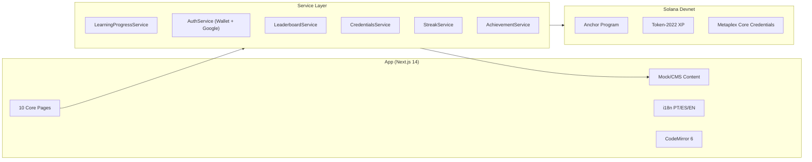

# Architecture — Superteam Academy

## System Diagram



## Component Flow

```
layout.tsx
└── shell.tsx (AppShell)
    ├── AuthProvider (NextAuth)
    ├── I18nProvider (locale context)
    └── SolanaWalletProvider
        ├── SiteHeader (nav + wallet + i18n)
        └── {children} (page routes)
```

## Data Flow

### Enrollment (Real On-Chain)
1. User clicks "Enroll" on course page
2. Frontend derives Enrollment PDA: `[enrollment, courseId, wallet]`
3. Wallet Adapter prompts user to sign `enroll` instruction
4. Transaction is sent to Devnet
5. Enrollment PDA is created with empty lesson bitmap

### Lesson Completion (Stub → Backend Signer)
1. User completes lesson content/challenge
2. Frontend calls `POST /api/progress/complete`
3. Backend verifies completion criteria
4. Backend signer calls `complete_lesson` instruction
5. XP is minted to learner's Token-2022 ATA

### XP Balance (Real On-Chain Read)
1. Frontend reads Config PDA for XP Mint address
2. Derives user's Associated Token Account
3. Queries Token-2022 balance
4. Calculates level: `floor(sqrt(xp / 100))`

### Credentials (Helius DAS)
1. Frontend queries Helius `getAssetsByOwner`
2. Filters by track collection address
3. Reads attributes: `track_id, level, courses_completed, total_xp`
4. Displays as verifiable NFT cards with Explorer links

## PDA Map

| PDA | Seeds | Purpose |
|-----|-------|---------|
| Config | `["config"]` | Platform settings, XP mint, authority |
| Course | `["course", courseId]` | Course metadata, lesson count, XP rate |
| Enrollment | `["enrollment", courseId, wallet]` | Learner progress bitmap |
| MinterRole | `["minter", wallet]` | XP minting permissions |
| AchievementType | `["achievement", achievementId]` | Achievement definition |
| AchievementReceipt | `["achievement_receipt", achievementId, wallet]` | Awarded badge |

## Service Interfaces

Each service has a typed interface and a stub implementation. To go live, replace the stub class with an on-chain implementation:

```typescript
// Current: StubLearningProgressService → returns mock data
// Target:  OnChainLearningProgressService → reads PDAs + Token-2022
```

| Service | Real Reads | Stub Actions |
|---------|-----------|-------------|
| LearningProgress | XP balance, credentials | completeLesson, streaks |
| Enrollment | Enrollment PDA, enroll tx | close_enrollment |
| Credentials | Helius DAS query | — |
| Leaderboard | Token balance index | snapshot periods |
| Streak | — | All (localStorage) |
| Achievement | Receipt PDAs | claim |

## Security Model

| Role | Can Do | Signer |
|------|--------|--------|
| Learner | enroll, close_enrollment | User wallet |
| Backend | complete_lesson, finalize_course, issue/upgrade_credential | Backend keypair |
| Admin | initialize, create/update courses, register minters | Config authority |
| Minter | reward_xp | Registered minter keypair |
